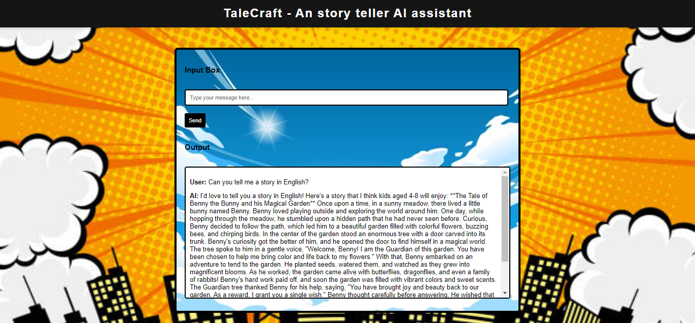

# TaleCraft - An AI Storyteller Assistant

TaleCraft is an AI-powered storytelling assistant designed to create engaging and interactive stories for users. The chatbot allows users to select their preferred language (Hindi or English) and enjoy a variety of tales tailored to their choices.



## Features

- **User-friendly Interface**: Simple and elegant interface for easy interaction.
- **AI-Powered Storytelling**: The assistant uses AI to generate interesting and personalized stories for the users.
- **Real-time Feedback**: Immediate responses to user input and continuous story development.
- **Language Choice**: Users can choose to listen to stories in Hindi or English, making it accessible for a broader audience.
- **Interactive Story Types**: Different genres of stories, including Jungle Adventures, Thrillers, and Educational stories, are available.

## Story Genres

When the user interacts with StorySphere, they can select the type of story they would like to hear. The available options are:

1. **Farmer's Story** (किसान की कहानी)
2. **Jungle Prince** (जंगल का राजकुमार)
3. **True Friendship** (सच्ची दोस्ती)
4. **Amazing Earth** (अद्भुत पृथ्वी)
5. **And more** (और कुछ अन्य...)

Once the user selects a genre, the AI will start generating the story based on their selection, and they can continue the interaction with further inputs.

## Technologies Used

- HTML
- CSS
- JavaScript
- Node.js (for backend)
- Gaianet for AI-powered responses

## Setup and Installation

1. Clone the repository:

   ```bash
   git clone https://github.com/SaturoGojo18/TaleCraft.git


2. Navigate to the project directory:

    ```bash 
    cd TaleCraft

3. Install dependencies:

    ```bash 
    npm install

4. Start the development server:

    ```bash
    node index.js

5. Open your browser and visit:

    ```bash
    http://localhost:3000

## Thanks!
